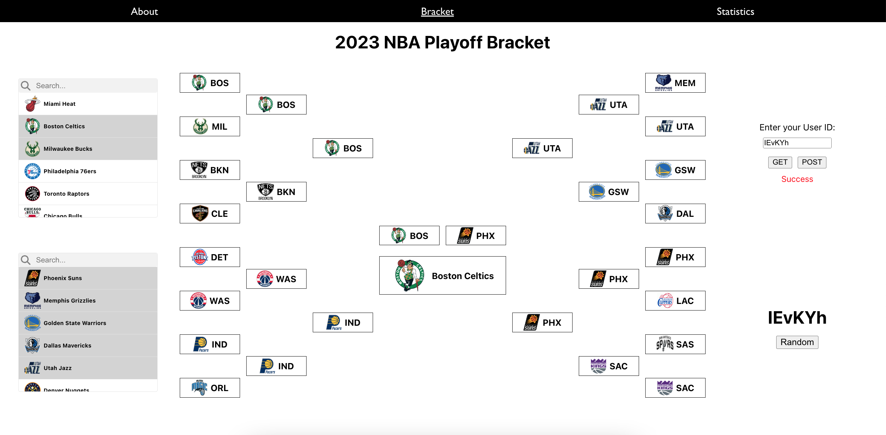

# NBA Playoff Bracket 2023

This is a project built for NBA fans who want to create their own NBA playoff bracket prediction and easily share with other people.. 

People can build their project from scratch, commit their project with a unique ID, and fetch their prediction using the unique ID.

There are two search lists, with each search list showing teams in the Eastern Conference or Western Conference.

Upon clicking teams in the search list, the user can progress their bracket by clicking on the teams that will show in the bracket.

The user can save their progress at anytime by entering a unique 6 letter ID and clicking "Post" button. If the unique ID is not in the database and is unique, the progress will be saved and the message of "Post Successful" will show. However, if the ID is already stored in the database and is not unique, the user may use another ID. To help the users generate a unique ID, the user can click the Random Button to get a unique 6 letter ID.

The user can  fetch their bracket by entering the unique ID the user used to store the bracket and clicking "Get" button. If the unique ID has been saved in the past, then the message "Success" will show
